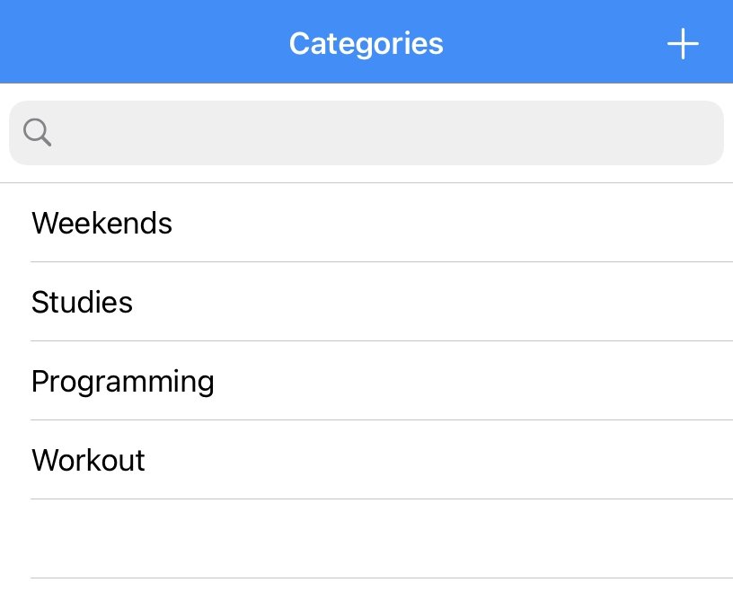
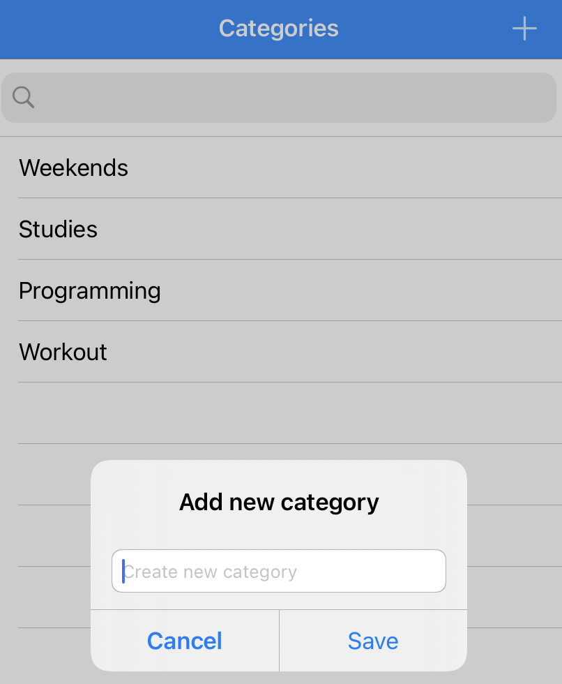
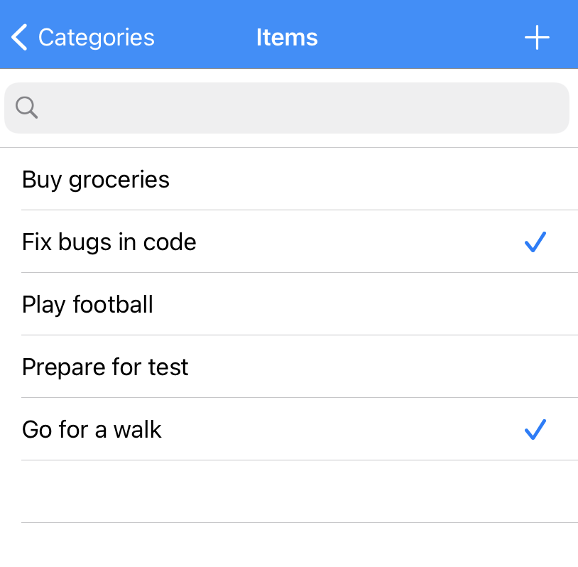
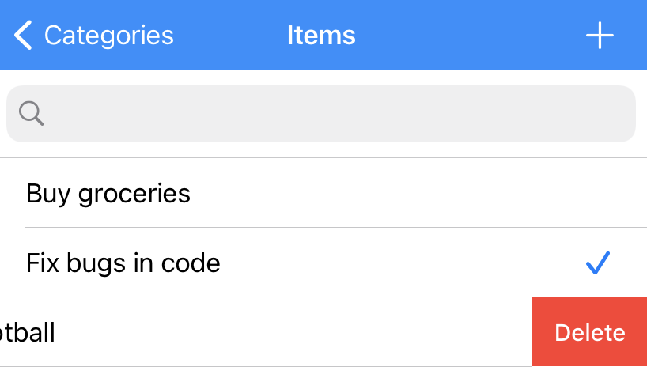
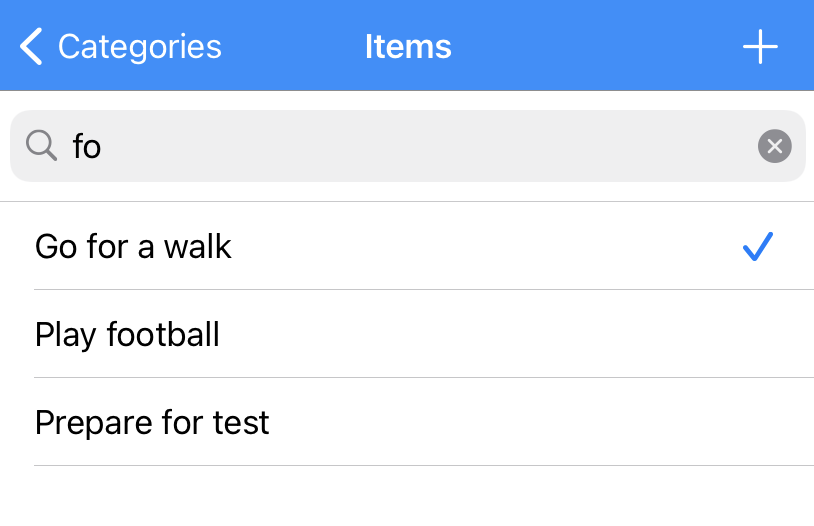

# ToDoList
To Do List Project from Udemy Course "Core Data and Realm - Master Data Persistence for iOS"

## Description

This simple app lets users create To Do Lists organized in categories. By tapping on any category the list of corresponding items appears on the screen:

The application supports the following functions as well:
* A user can tick any of items or remove it later
* Items and categories can be deleted
* By using a search bar on top of the screen a user can search for specific items

## Implementation

The app was implemented using UITableViewController. It also supports data persistence by using basic functionality of Core Data Framework for CRUD operations.

## Results

I learned about Core Data concepts, how to perform CRUD operations and how UITableView manages reusable cells
